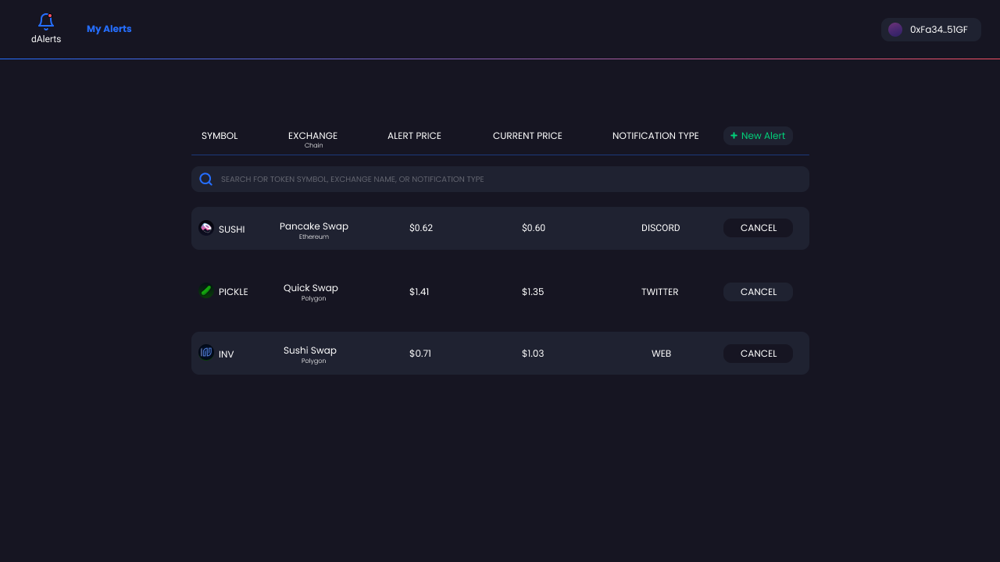
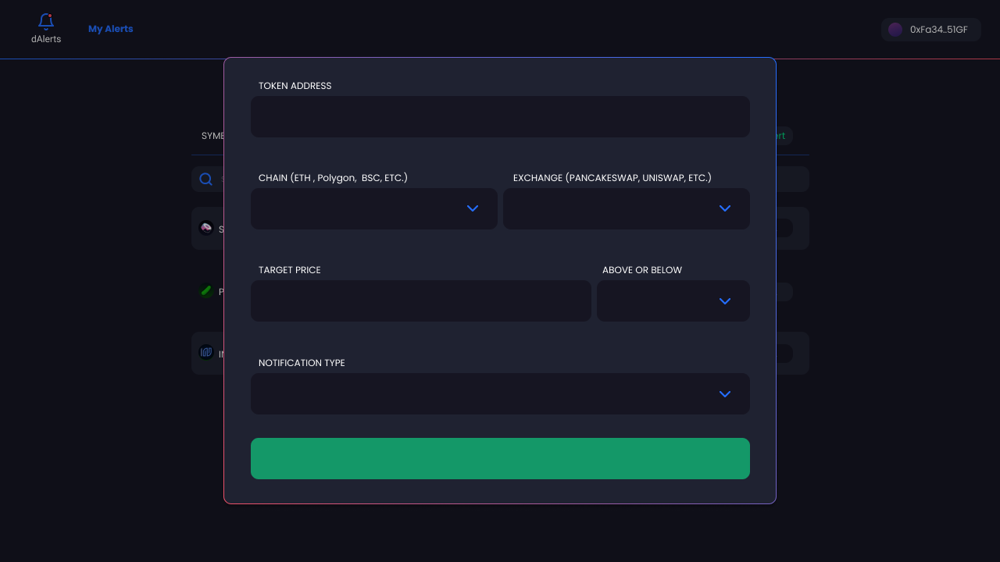

  

 

<h1 align="center">dAlert</h1>

My task is to build dAlerts, a notification system for DEX (decentralized exchanges), more
information below. The following is a ReactJS front end test. As part of this assignment here are
the following learning outcomes....

<h1 align="center">
  
  
</h1>

## Summary

  - [Begin](#Begin)
  - [Requirement](#Requeriment)
  - [Installation](#Installation)
  - [Test](#Test)
  - [Deploy](#Deploy)
  - [Author](#Author)
  - [Useful technologies](#Useful-technologies)

## Begin

Follow the instructions below to run the app.

## Requirements

What do  you need to run.

* **[Node v>=13.8.0](https://nodejs.org/en/)** - Install Node JS in your machine.

### Instalation

- Install all the dependencies.

Execute

    npm install

Or

    yarn install

- Start the project.
 
    npm start

Or

    yarn start

## Test

Executes the test

    npm test

## Deploy

 - Netlify
## Author

  - **Mário Batalha**     

## Technologies
  - TS
  - HTML5 & CSS3
  - React
  - Node-SASS
  - React-icons
  - React Router
